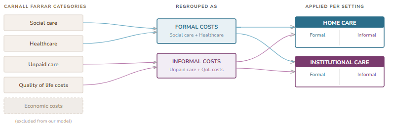
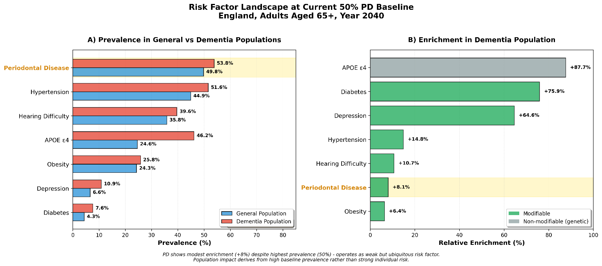
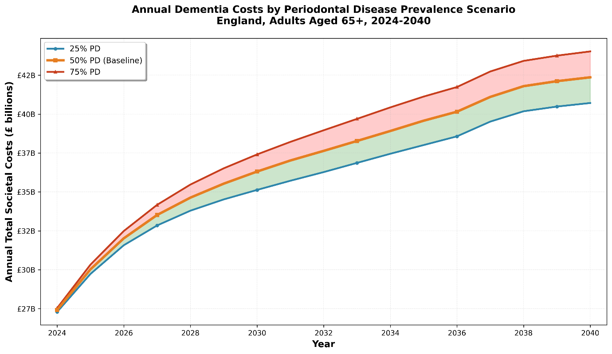
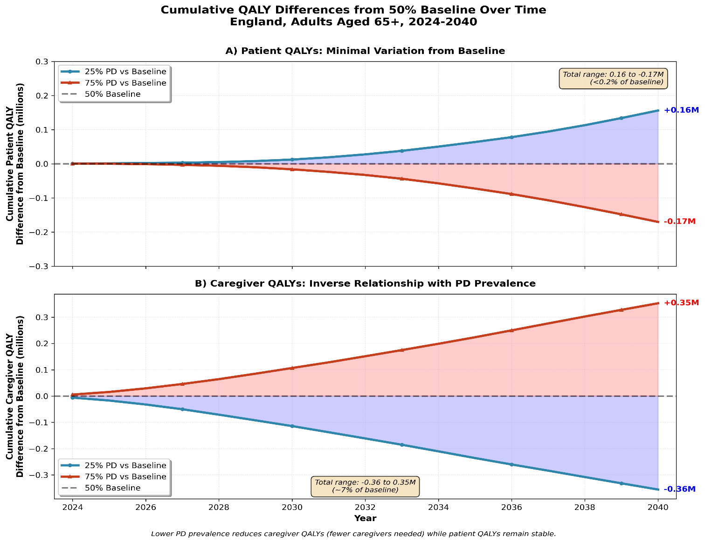

**The impact of periodontal disease prevalence scenarios on the costs and prevalence of dementia in England: a modelling study**

Edward Coote, Dr Nitesh Patel, Dr Rajesh Vijayanarayanan

**Author information**

**Keywords**

**Statements & Declarations**

**Funding**

**Competing Interests**

**Author Contributions**

**Ethics Approval **

N/a

**Consent to Participate**

N/a

**Consent to Publish **

N/a

**Abstract**

**Background**

Periodontal disease (PD) is a prevalent modifiable dementia risk factor that is becoming increasingly established with increased dementia incidence. At least 50% of over-65 year olds in England are affected by irreversible PD, and dementia-related costs are projected to rise substantially. Understanding the potential impact of PD prevalence changes on future dementia burden is key for healthcare planning and intervention risk factor prevention. 

**Methods**

We developed an individual-level microsimulation model simulating the England population aged 65 and older from 2024 to 2040 (yearly timesteps). We incorporated increasing dementia severity stages, care setting transitions and six modifiable risk factors alongside APOE ε4 carrier status. Age-related dementia onset was driven by a parametric age-scaled hazard. Individual risk factor hazard ratios (HR) were applied multiplicatively. We estimated dementia incidence, prevalence, formal and informal care costs, and quality-adjusted life years (QALYs) under three PD prevalence scenarios (25%, 50% baseline, 75%). Our sensitivity analysis included probabilistic sensitivity analysis (PSA) and deterministic one-way sensitivity analysis on the PD-dementia onset HR. 

**Results**

At 50% PD prevalence, cumulative dementia incidence totalled 2.80 million cases over 2024–2040, with prevalence rising from 7.95% to 10.14%. Reducing PD prevalence to 25% prevented approximately 115,000 incident cases (4.1% reduction) and generated cumulative cost savings of £19.7 billion (£10.9bn formal; £8.8bn informal). Each percentage point reduction in PD prevalence was associated with approximately 678 fewer annual dementia onsets and £46 million in annual savings. Population QALYs varied by less than 0.2% across scenarios. Probabilistic sensitivity analysis confirmed robustness across all outcomes (coefficient of variation 5.2%–10.4%).

**Conclusions**

Reductions in PD prevalence, if the observed association with dementia is causal, could yield substantial reductions in dementia incidence and associated costs in England. PD functions as a weak but highly prevalent risk factor, where population-level benefits derive from the large exposed population rather than strong individual risk. 

**Introduction**

The burden of periodontal diseases (PD) in England is substantial. NHS Dental estimates that at least 50% of the UK have some level of irreversible (≥stage 3) periodontal disease (PD), although this is likely to be an underestimate [1]. Globally, there was an estimated 50% increase in oral disease cases between 1990 and 2019, which was higher than the 45% population growth over the period [2]. This trend is expected to increase in high-income countries as the ageing population results in individuals living longer with chronic diseases [3]. Estimations using multi-state population models for periodontal pocketing in the UK project an 8.7% increase from 2020 to 2050, with severe pocketing increasing by 56.7% [4]. 

There is substantial evidence that PD is a risk factor for dementia [5,6]. Periodontal infection leads to systemic inflammation, allowing high inflammatory immune responses to cross the blood-brain barrier which activates the microglial cells in the cerebral cortex, which may contribute to the pathogenesis of dementia [7,8]. Dementia patients have shown higher *fusobacterium* loads, as well as *Campylobacter rectus *and *Porphyromonas gingivalis*, both species of bacteria that are biomarkers for severe PD [9]. One review found that PD was associated with a 22% higher risk of incident dementia during a mean follow up of 11 years, with another using population studies to suggest a relative risk (RR) of 1.18 (1.06-1.31) for incident dementia in relation to PD [6,10]. There is bidirectional causality, as an individual’s ability to maintain their oral health deteriorates with increased dementia symptoms [11]. However, trial emulation studies testing periodontal treatments have shown their ability to reduce dementia-related brain atrophy in the treatment arms (-0.41; 95% CI; -0.70 to -0.12; *P*= 0.0051) [12]. A retrospective population study also identified that periodontal treatment reduced the risk of dementia mortality [13]. Longitudinal population studies have revealed that PD was significantly associated with increased dementia incidence, even after adjusting for major chronic diseases [14,15,16]. These longitudinal studies were restricted to dementia-free participants at baseline, minimising reverse causality. 

Dementia costs in England are expected to rise significantly, with one estimate forecasting a 173% rise from 2019 to 2040, totalling £80.4 billion by 2040 [17]. The same projection gives 1.35 million total older people living with dementia in England in 2040. Approximately 45% of all dementia cases are attributable to preventable risk factors [18]. Modelling the effects of population-based interventions on dementia risk factors can provide estimates of potential cost-saving and disease reduction. If hypertension prevalence fell in England and Wales by 50% between 2027 and 2060, an estimated 57 fewer deaths per 100,000 population but an increase of 9 more dementia cases per 100,000 is expected [19]. This highlights the interplay between reduced risk factor prevalence and extended life expectancy, which may raise overall dementia prevalence despite a risk factor intervention. A 50% reduction in the current global prevalence of PD could prevent 850,000 individuals from developing dementia [6]. Given the strong evidence linking periodontal disease to dementia and the projected rise in dementia-related costs, estimating the effects of reducing periodontal disease prevalence is essential to inform prevention strategies. 

We use an individual-level microsimulation model to estimate the costs and benefits associated with counterfactual scenarios in severe PD prevalence on future dementia outcomes. We start with the current estimated PD prevalence of 50%, then test a prevalence of 25% and 75%. This will account for the effects of other dementia risk factors on both dementia and mortality risk. 

**Methods**

**Model overview**

We simulated the England population (aged 65 years and older) from a 2023 baseline, used for initialisation only, to 2040 in annual time steps, with results reported from 2024 onward. New individuals entered the model yearly through a fixed-size entrant population (n = 700,000), reweighted and sized to match age- and sex-specific (validated using that) population projections from the Office for National Statistics [20,21]. The baseline dementia prevalence, age distribution and severity stage mix was set using the Primary Care Dementia Data register. Dementia was defined as diagnosed all-cause dementia, referring to any type of dementia regardless of its cause [22]. We developed a stochastic time-to-event microsimulation model with a dementia stage structure consistent with previous dementia progression models, using longitudinal evidence and mortality projections to inform transition hazards [19, 23, 24, 25]. 

Dementia in our model is split in five stages; cognitively normal, mild, moderate, severe, and death. Dementia-related death was permitted only in the severe stage, while background mortality could occur from any state. Disease state changes are simulated each year. Individuals with dementia could transition between home and institution (or remain in current) care each year based on setting transition probabilities [26]. The baseline onset probability of dementia was calculated using current dementia incidence from NHS England data. We externally validated our model to observed prevalence data from 2023 to 2024, with goodness of fit assessed with  and slope coefficients. 

**Equation 1 **Dementia onset formula 

The mean time in each dementia stage has been collected from [27]. This provides a constant hazard (exponential assumptions) for the effect that time in a dementia stage has on disease progression. Initial dementia stage was set from a previously published report [26]. We used a parametric proportional hazards age effect to scale the increasing effects that age has on dementia onset. This provides a continuous increase in risk with age rather than discrete banding, as seen in longitudinal studies of dementia incidence [28]. We calculated the relevant β for the per-year log-hazard slope increase of stage transitions [29,30,31]. Risk factor hazard ratios were applied to dementia onset. Onset from cognitively normal is driven by a baseline annual onset probability (converted to a hazard), then scaled by a parametric age effect and individual risk-factor hazard ratios (Equation 1). Full details of our model mechanisms are provided in the supplementary information (pp.x-x). 

**Risk factors**

In this model, risk factors only interact with dementia onset. Progression uses exponential stage-duration hazards, scaled by age. We only modelled disease- and genetic-related risk factors (leaving out socioeconomic and lifestyle-related risk factors). We used a single study for all HR’s and prevalences, which derived them from the UK Biobank (Table 1), except for PD [32]. We obtained the HR for PD-dementia onset from a meta-analysis (n = 23) of longitudinal studies that accounted for reverse causality [33]. We applied the pooled HR from, which reflects a composite of periodontal health measures, to an NHS prevalence estimate broadly consistent with the moderate-to-severe periodontal involvement captured across the included studies. Disease prevalence (except PD) and HRs were held constant throughout the forecast. This risk set captures the vascular and inflammatory pathways that influence cognitive decline. We decided not to measure lifestyle factors due to difficulty in establishing prevalence rates relevant for individuals in later life, and uncertainty over the role of early life socioeconomic factors (education level) on dementia onset specific to over 65 year olds. 

| Risk factor | HR (95% CI) | Prevalence |
|---|---|---|
| Periodontal disease | 1.21 (1.07-1.38) | 25%/50%/75% |
| Hearing difficulty | 1.21 (1.15-1.27) | 36% |
| Hypertension | 1.36 (1.28-1.45) | 45.2% |
| Obesity | 1.10 (1.03-1.18) | 24.3% |
| Depression | 1.93 (1.74-2.13) | 6.8% |
| Type 2 Diabetes | 2.06 (1.92-2.22) | 4.5% |
| APOE ε4 carrier | 3.03 (2.88-3.19) | 25.6% |

**Table**** ****1**** **Hazard Ratios (HR) and prevalence rates for diseases modelled 

**Estimation of costs and QALYs**

We estimated the economic costs of dementia for direct formal healthcare and social care and informal caregivers. Table 2 shows the yearly costs used and Figure 1 shows how care costing was allocated. Costing data was sourced from a 2024 report on dementia and converted to 2023 values using GDP deflators [34,35]. For direct formal healthcare and social care costs we included healthcare and social care. Informal costs include unpaid care and quality of life costs, which we separated into costs for dementia patients in home or institution care (Supplementary Material pp.xx-xx). This means our total per person costs of dementia by severity are less than the values found in the Carnall Farrar as our model allocates costs by care setting and then distinguishes between formal and informal, rather than aggregated as single per-person costs. We excluded economic costs as these account for a reduction in consumption, which isn’t a cost saving from a healthcare and social care system’s perspective. 

QALYs are commonly used to value the benefit of interventions, with one QALY equating a year of life in perfect health [36]. This means years of life can take into account the quality and quantity of life. Dementia stage specific QALY utility values were obtained from a previous study modelling the benefits of population-level interventions for dementia risk factors and applied to those with dementia [37]. Age specific utility values for cognitively normal were taken from the UK Population Norms for EQ-5D [38]. An informal caregiver for someone with dementia will also see their quality of life affected due to the strain of care. We attach caregivers (and caregiver QALYs) to those with dementia being treated at home. These caregivers are not part of the simulated population size. These utility values were attained from literature assessing the impact of caring for people with dementia [39]. Despite the National Institute of  Care and Excellence (NICE) and the UK Treasury suggestion to annually discount costs and QALYs at 3.5%, we decided not to in order to increase comparability of results [40]. Within each calendar year, differences in total QALYs between scenarios reflect changes attributable to PD-driven differences in dementia onset, survival, and progression (and associated caregiver impacts), holding all other model components constant. Full methodology for the measurement of costs and QALYs can be found in the supplementary information (pp.x-x). 

|  | Home Care | Home Care | Home Care | Institutional Care | Institutional Care | Institutional Care |
|---|---|---|---|---|---|---|
| Severity | Formal | Informal | Total | Formal | Informal | Total |
| Mild | £7,466.70 | £10,189.55 | £17,656.25 | £23,144.27 | £874.93 | £24,019.19 |
| Moderate | £7,180.18 | £33,726.09 | £40,906.28 | £15,552.58 | £1,643.14 | £17,195.71 |
| Severe | £7,668.60 | £31,523.39 | £39,191.99 | £53,084.13 | £501.88 | £53,586.01 |

**Table ****2**** **Yearly costs by dementia stage by living setting (£)

**Figure ****1**** **Flowchart of care setting allocation compared to Carnall Farrar 2024 report

**Outcomes**

Differences in dementia incidence and prevalence over time were estimated under each PD prevalence scenario and compared. The model estimated the costs and QALYs attached with dementia, reported year-by-year and cumulatively. Costs were categorised by formal care giving and informal care costs. QALYs were aggregated by whole population (including individuals with dementia) and informal home caregivers. This allowed for the comparison of total and annual cost savings, QALYs, and cost savings per dementia case avoided, between the differences in PD prevalence runs. 

**Sensitivity analysis**

We conducted probabilistic sensitivity analysis (PSA) with 500 Monte Carlo iterations for 1% of the target population (n = 107,874), sampling uncertain parameters from probability distributions (sampling costs with the gamma distribution, utilities and probabilities with beta, and risk HRs with lognormal from CIs; relative SD = 10%) [41]. The outcomes were then scaled back up by a factor of 100. This was due to the computational strain of sampling for the full population. Results are reported as means with 95% confidence intervals. Coefficients of variation ((standard deviation / mean)*100) are also reported.

Deterministic one-way sensitivity analysis was conducted to specifically address the uncertainty surrounding PD’s impact on dementia onset using the published 95% CI bounds for PD HRs (1.07-1.38 for onset). We used 100% of the total population, with each lower and upper bound of the HR used for each PD prevalence run. 

**Results**

**Disease outcomes**

Over the 2024-2040 forecast period, cumulative dementia incidence at the current 50% PD incident onset totalled 2.80 million cases, with prevalence increasing by 32% (Table 3). Reducing prevalence to 25% prevented 114,814 cases (4.1% reduction; 95% CI:XX), while the 75% deterioration scenario resulted in an additional 112,921 cases (3.9% increase; 95% CI:XX) from baseline. In the baseline run, dementia prevalence increased from 7.95% in 2024 to 10.14% in 2040, primarily driven by the ageing population. Annual dementia incidence at 50% PD prevalence increased from 151,000 cases in 2024, to 180,000 cases in 2040. The 25% intervention scenario consistently showed ~7,000 fewer annual cases, with the 75% deterioration scenario resulting in ~7,000 more annual cases. The symmetric effects between both an increase and decreases demonstrate linear dose-response in both directions from baseline.

| Outcome | 25% PD | 50% PD (Baseline) | 75% PD |
|---|---|---|---|
| Dementia Burden | Dementia Burden | Dementia Burden | Dementia Burden |
| Total incident cases | 2,516,334 | 2,804,596 | 2,917,517 |
| 2024-2040 difference (% change) | 21 | 19 | 18 |
| Final prevalence (2040) | 1,098,064 | 1,140,670 | 1,186,110 |
| 2024-2040 difference (% change) | 29 | 32 | 37 |
| Cases per 100,000 population | 24,089 | 25,138 | 26,164 |
| Economic Outcomes | Economic Outcomes | Economic Outcomes | Economic Outcomes |
| Total formal costs (£bn) | 340.57 | 351.49 | 362.34 |
| 2024-2040 difference (% change, year-by-year) | 174 | 184 | 193 |
| Total informal costs (£bn) | 268.13 | 276.94 | 285.70 |
| 2024-2040 difference (% change, year-by-year) | -12 | -9 | -6 |
| Health Utilities | Health Utilities | Health Utilities | Health Utilities |
| Total population QALYs (mn) | 141.38 | 141.22 | 141.05 |
| Total caregiver QALYs | 10.20 | 10.55 | 10.90 |

**Table**** ****3**** **Outcomes by scenario. PD = periodontal disease. 2024£ costs.

**Figure**** ****2**** **Comparative risk factor landscape at 50% PD prevalence baseline 

**Economic outcomes**

Cumulative formal healthcare costs at a PD prevalence of 50% reached £351.49bn (Figure 3). At 25% prevalence, there was formal healthcare cost savings of £10.92bn (3.1% reduction), while a prevalence of 75% resulted in additional costs of £10.85bn (3.0% increase). Initially, informal healthcare costs exceeded formal healthcare costs (2024: £18.4bn vs £9bn) but were surpassed in 2027 (formal care: £17.11bn; informal care: £16.41bn). This is as more individuals with dementia moved into institutional care (for 50% prevalence run: 2024: 12% in formal care institution; 2027: 30% in formal care institution; 2030: 36% in formal care institution; 2040: 38% in formal care institution), and as the time progressed in the model those in care accrued more per-person costs. Cumulative informal healthcare costs at a PD prevalence of 50% reached £276.94bn. 25% PD prevalence saw informal cost savings of £8.81bn, and a PD prevalence of 75% resulted in an increase of £8.77bn. Over the forecast period, this averages to £171,000-£173,000 total saved per dementia case avoided. Given an average dementia cost per individual (2024-2040) of £35,977 (50% prevalence), this implies that preventing one case avoids approximately 5-years of dementia-related care costs. This can also be interpreted as the average duration individuals live with dementia in the model. 

**Figure ****4**** **Cumulative QALY differences from 50% baseline 2024-2040

**Health utility outcomes**

For both the lower prevalence and higher prevalence scenario, population QALYs differed marginally from the baseline 50% prevalence, with only small year-on-year differences within the PD prevalences (Figure 4). Total population QALYs (not including caregiver QALYs) totalled 141.38mn at 25% PD prevalence, 141.22mn at 50%, and 141.05mn at 75%. This is less than a 0.2% variation around the baseline. Year-by-year population QALYs remained stable across scenarios, varying by less than 200,000 QALYs across 2024-2040. Caregiver QALYs, assigned to each individual with dementia, demonstrated greater variability.  The lower 25% PD prevalence resulted in 10.20 million caregiver QALYs, 50% PD prevalence 10.55 million, and 75% PD prevalence 10.90 million. This relationship represents the model structure, as a reduced dementia population resulted in a smaller caregiver population, and therefore less caregiver QALYs accrued. 

**Sensitivity analysis results**

Our PSA results demonstrate the stability of our base case results across all three prevalence scenarios, displaying robustness to parameter uncertainty (summarised in Table 4, full results in Supplementary Materials Table XXX). Total costs ranged from £610.0bn (95% CI: £509.3bn–£710.9bn) at 25% PD prevalence to £651.2bn (95% CI: £535.7bn–£765.3bn) at 75% PD prevalence, with coefficients of variation between 8.3% and 8.9%. Total QALYs were highly stable across scenarios, ranging from 151.9mn to 152.4mn with the lowest uncertainty of any outcome (CV: 5.2%–5.3%). Cumulative incident dementia cases ranged from 2.7mn at 25% PD prevalence (95% CI: 2.2mn–3.2mn) to 2.9mn at 75% PD prevalence (95% CI: 2.4mn–3.5mn), with slightly higher variation (CV: 9.1%–9.7%). All outcomes displayed narrow confidence intervals and consistent behaviour across PD prevalence scenarios, supporting the robustness of the base case findings.

| Outcome | 25% PD Prevalence | 50% PD Prevalence | 75% PD Prevalence |
|---|---|---|---|
| Total costs (£bn) | 610.04 (509.31-710.92); CV: 8.3% | 630.7 (521.0-739.0); CV: 8.6% | 651.2 (535.7-765.3); 8.9% |
| Total QALYs (mn) | 151.9 (136.1-167.2); CV: 5.3% | 152.2 (136.4-167.3); CV: 5.3% | 152.4 (136.6-167.4); 5.2% |
| Incident cases (mn) | 2.7 (2.2-3.2); CV: 9.1% | 2.8 (2.3-3.3); CV: 9.3% | 2.9 (2.4-3.5); 9.7% |

**Table**** ****4**** **Summary of cumulative PSA results. 2024£ costs. 

The results of our one-way sensitivity analysis are summarised in Table 5 (full results in Supplementary Material, Table XXX). Using the lower HR reduced total costs, caregiver QALYs, and incident dementia onsets by 8%–13% across scenarios. Total population QALYs were largely insensitive to HR variation, changing by only ±3% across all scenarios. All results behaved as expected, except the fall in total incident onsets under 25% PD prevalence when the upper bound HR was used. For all other outputs, using the upper HR led to total costs falling by 1%–5% and incident onsets increasing by up to 3% under the 75% PD prevalence scenario. 

| PD prevalence | HR  Used | Total Costs (% change from baseline) | Total population QALYs* (% change from baseline) | Total caregiver QALYs (% change from baseline) | Total Incident Onsets (% change from baseline) |
|---|---|---|---|---|---|
| 75% | High (1.38) | £  643,958,973,993.60 (-1) | 136,230,776.09 (-3) | 10,981,842.40 (1) | 3,087,083 (3) |
|  | Low (1.07) | £  564,567,763,775.41 (-13) | 136,915,148.84 (-3) | 9,545,927.86 (-12) | 2,621,631 (-13) |
| 50% | High (1.38) | £  611,051,531,957.90 (-3) | 136,513,710.72 (-3) | 10,394,266.97 (-1) | 2,894,042 (0) |
|  | Low (1.07) | £  558,137,902,469.89 (-11) | 136,968,559.56 (-3) | 9,430,100.22 (-11) | 2,582,837 (-11) |
| 25% | High (1.38) | £  578,289,719,287.51 (-5) | 136,784,210.03 (-3) | 9,799,130.70 (-4) | 2,701,735 (-3) |
|  | Low (1.07) | £  551,576,202,882.79 (-9) | 137,010,344.18 (-3) | 9,312,173.99 (-9) | 2,544,945 (-8) |

**Table 5 **One-way sensitivity results from varying periodontal disease-dementia onset HR. * = Not including caregiver QALYs. All costs are in 2024£.

**Discussion**

**Model validation**

Our one-year validation of population structure and prevalence demonstrated good model fit (Supplementary Material, Figure X-X). We have compared our 50% PD prevalence model with the results of existing dementia models (Supplementary Material, Table XXX). Given the consistency in model outcomes, provided the differences in ONS population projections used and per dementia case cost differences, our results are comparable to previously published forecasts. We also ran a model version with risk factor prevalences set to 0 and HRs det to 1 to calculate the dementia burden not attributable to preventable risk factors. In our model, 33% of dementia cases are preventable, slightly below the suggested 40%, which suggests slightly stronger model age effects [18]. 

**Interpretation and p****olicy implications ****of results**

At a current PD prevalence of 50%, we projected that there will be 2.80 million incident dementia cases among adults aged 65+ in England over 2024-2040. Halving PD prevalence to 25% could prevent 114,814 incident cases, while increasing it to 75% added 112,921 incident cases. Total dementia-related cost savings from halving PD were £19.7bn, comprised of £10.9bn in formal healthcare and £8.8bn in informal care costs. Likewise with the difference in incident dementia cases avoided, additional cost associated with increased PD prevalence were symmetrical. Population QALYs showed minimal variation across scenarios (<0.2% difference), while caregiver QALYs had an inverse relationship with PD prevalence, as there were fewer caregivers when fewer dementia cases occur. The dementia cost structure shifted from informal care dominance at model initiation (2024: £18.4bn vs £9.0bn) to formal care dominance by 2027 as dementia severity increases and institutionalisation rates rose from 12% to 38%. The size of our estimated benefits are large due to the high prevalence of PD, and the large increase and decrease to 75% and 25%. Our results have to be considered in context of this, although our overall costs are lowering than previously reports due to our use of a lower per person dementia cost. Each percentage point reduction in PD prevalence was associated with approximately 678 less annual dementia onsets (~11,530 over the 2024-2040 forecast period) and £46mn in total annual savings (£789mn over the 2024-2040 forecast period). Annual differences grow over time, so this summary overestimates outputs in the early years and underestimates in the latter. 

Using an individual-level microsimulation approach, we model a population-level exposure shift rather than the effect of a specific, costed intervention, meaning the estimates reflect the potential effects of sustained reductions in PD prevalence. This study does not consider the costs of such an intervention that would lower PD, or at what per-year rate it would lower PD prevalence by, therefore further cost-effectiveness methods should be incorporated from these results. Our model focuses on individuals aged 65 years and older, aligning with common dementia projections and capturing the population at highest risk of both severe PD and dementia. Given the high prevalence of PD disease in England, even modest population-level reductions can lead to substantial public health and economic benefits. However, there is currently an absence of research on or a previously introduced individual-level PD intervention itself. This provided the rationale for a scenario exposure shift investigation, and not testing a specific intervention. 

Our model estimates rely entirely on the assumption that the observed associated between PD and dementia onset is casual. The HR used was derived from a meta-analysis of 23 longitudinal studies that accounted for reverse causality. It included the largest number of longitudinal studies and accounted for multiple effects estimates, yet, the authors note that there was heterogeneity across the exposure definitions used by the studies included [33]. Our model applies this pooled estimate as a single risk factor, which means the modelled PD exposure does not correspond to a single clinical definition, but reflects the wider ‘some level of irreversible periodontitis’ definition used by NHS England [1]. We consider these to be compatible, especially considering the lack of consensus around what explicitly defines PD, although the exact alignment cannot be confirmed [42]. This reflects a current issue in dental epidemiology, rather than a flaw in our modelling methods used. 

At 50% prevalence, PD was the most preventable modifiable risk factor in the model. However, PD showed only 8% relative enrichment in the dementia population (53.8% vs 49.8%) compared to 65% for depression (10.9% vs 6.6%), and 77% for Type 2 diabetes (7.6% vs 4.3%). This indicates PD as a weak but ubiquitous risk factor. Its role as a risk factor derives from its high prevalence rate rather than strong individual risk increase. As some level of irreversible PD affects at least 50% of over 65 year olds in England, but with a modest per-person risk (HR = 1.21), it offers a different but equally valuable prevention pathway when compared to rarer but higher risk risk factors, such as Type 2 diabetes (prevalence 4.5%, HR = 2.06). 

Our findings are important in the current context of the deteriorating English oral health profile. The 2023 Adult Oral Health survey reported that the current oral health of England is comparable to that of 1998, with 44% of 65-74 year olds in 2023 showing primary or secondary tooth decay, up from 21% in 2009 [43]. Between 2009 and 2023 there was a 9 percentage points decrease in the proportion who reported attending regular dental check-ups, and our findings add to the growing literature that the negative effects of untreated PD and a struggling dental  care system will have a health system-wide effect [44]. Improved attendance of preventable dental services by individuals could yield substantial dementia-related long-terms health and economic returns, especially if PD is caught at an early stage or in midlife. Integrating oral health screening into existing general NHS health check-ups or during chronic non-communicable disease prevention pathways could identify individuals with severe PD who may benefit most from dental treatment. Given severe PD’s high prevalence among older adults, even with the magnitude of its dementia-causality pathway being undetermined, it warrants consideration among other targeted high-risk strategies. We acknowledge the evidential limitations surrounding PD’s role in dementia onset found in the 2024 Lancet Commission, but the economic scale of the potential benefits demonstrated by our results, even under modest HR assumptions, suggest that exclusion from the modifiable risk factor framework is not warranted [18,45]. Further investigation through prospective studies and trial emulation will be key to establish the magnitude of PD’s role in dementia.

The economic outcomes of our model are almost entirely modelled by the dynamics of care settings and trends. We expect that as more incident dementia cases accrue, and as individuals with dementia survive for more years, institutional care settings are required more. Institutionalisation rates increased from 12% in 2024 to 38% in 2040, with institutional care settings generating higher per-person annual costs than informal costs. The higher institutional costs reflect the 24-hour professional care staffing requirements, facility costs and trained staff that can manage symptoms, rather than the more personal yet less professional one-to-one care of informal caregivers. Our results align with estimates that as many as 49% of individuals with dementia will be treated in a care home setting by 2040, driven by an increasing number of severe dementia cases (Supplementary Material, Figure XXX) [17]. Our one-way sensitivity analysis revealed that total costs decreased from baseline under both upper and lower HR bounds, which demonstrates the care setting dynamics in our model. A higher HR accelerates progression through severity stages into moderate stage, where institutional care has lower per-person costs than home care. Faster progression also increases mortality, reducing the cumulative person-years of care required. 

Our cost per cases prevented (~£172,000) represents approximately five years of dementia-related costs at an average annual cost of £36,000 per person. This is comparable to other previously published dementia projections. The total cost savings of £19.7bn over 2024-2040 translate to an annual average saving of £1.16bn. Population-level interventions combining hearing aids, smoking cessation and blood pressure treatment have been estimated to save £1.9bn annually while reducing dementia prevalence by 8.5% [46]. Further analysis found that reducing hypertension by the reformulation of food products to reduce salt would lead to cost-savings of £2.4bn per age population [37]. 

Using a per-capita basis, population QALYs averaged 0.74 per person per year with less than 0.001 QALY/person/year variation across scenarios. This demonstrates that dementia prevention through lowering risk factors works by reducing the number of individuals with dementia, and not by improving existing population health. Our small QALY findings are a function of how dementia utility is measured, and not a model limitation. It has been commonly discussed that utility values are flawed at estimating the negative health effects of having dementia [47]. The utility values by dementia stage severity we have used are at the upper bound of suggested values, but this was to be cautious when estimating final effects. Caregiver QALYs were more responsive to PD prevalence changes (25% PD prevalence: 10.20mn; 75% PD prevalence: 10.90mn; 6.8% variation), but this was expected given their structural dependence on dementia population size, and still demonstrated small variations. Given the QALY results in comparison to the other outputs, we suggest that the case for PD reduction relevant to caregivers derives more from informal care cost savings due to the value of unpaid caregiving time. This finding is consistent with the literature on prevention-focused dementia interventions [48]. Our findings support the view that individual-level results (QALYs per-person) can be modest but the societal benefits can be large due to the size of the potential target population [49].

**Strengths and limitations**

This study has several strengths. By using an individual-level microsimulation model we are able to more accurately capture heterogeneity in dementia progression and associated care patterns than aggregate population models. This is especially true for capturing competing risks factors, as we have incorporated multiple established dementia risk factors, alongside PD. This avoids the overestimation of PD’s isolated effect. A key strength is our use of recent ONS population projections (from 2023), 2024 cost estimates, and dementia late stage onset HRs from a large national population study (UK Biobank) with no dementia controlled at baseline [32]. We have based our model structure on the English population. However, given our use of HRs and prevalences from the UK Biobank our model is likely to be generalisable to the whole of the UK, given re-initialisation of baseline population to the specific country or region. 

Our model has several structure limitations that are bounded by the data available. Our model assumes constant risk factor prevalence and HRs over time. This does not reflect the reality of the over 65 years population in England, where risk factor prevalence is likely to vary as targeted initiatives lead to a more or less healthy population. We also model PD, and other risk factors such as hypertension and Type 2 diabetes, as binary risk factors. This does not capture the severity gradients of the diseases that will affect the onset of dementia [50]. PD does not interact with other risk factors in our model. The joint effect of having both PD and hypertension is assumed to be the product of their individual HRs, with no additional interactive effect. Despite established links between PD, obesity, and hypertension, there is an absence of evidence that quantifies any departure from multiplicative joint effects on dementia incidence [52]. Adding such interactions into this model relying on using multiple different studies from various study populations would introduce additional heterogeneity. Finally, our model relies on observational HRs which may include residual confounding despite covariate adjustment in the source study. These sources generally adjusted for comorbidities, such as hypertension and diabetes, which we modelled as independent risk factors. Therefore, applying these covariate-adjusted HRs multiplicatively may have actually resulted in more conservative estimates as the PD HR used captures only its direct effect on dementia onset. 

**Conclusion**

PD’s contribution to the dementia burden in over 65 year olds in England derives from its high population prevalence rather than strong individual-level risk. The deteriorating oral health profile of England, which includes declining dental appointment attendance and worsening periodontal outcomes, makes our findings key in disease intervention planning. Our results support the case for including PD within the established modifiable dementia risk factor frameworks, especially due to the absence of individual-level interventions in England that target these at risk populations. Given the best available evidence, we estimate that halving PD prevalence to 25% could prevent approximately 115,000 dementia cases and save £19.7 billion over 2024–2040. The results of our sensitivity analysis show that the economic and health impacts are substantial across PD-dementia onset magnitudes, conditional on the observed PD-dementia association being causal. Given this, future research needs to include prospective studies and intervention trials with long follow-up to establish the true size of this causal effect. The advantage of open source microsimulation models such as this one is that they can be easily updated as new evidence arises. 

**References**

[1] Department of Health and Social Care, NHS England. *Delivering better oral health: an evidence-based toolkit for prevention. Chapter 5: periodontal diseases.* London: Department of Health and Social Care; updated 10 September 2025. Available from: .

[2] World Health Organization. *Global oral health status report: towards universal health coverage for oral health by 2030.* Geneva: World Health Organization; 2022 [Accessed 30 October 2025]. Available from: .

[3] United Nations Department of Economic and Social Affairs, Population Division. *World population prospects.* 2022 [Accessed October 21 2025]. Available from: .

[4] Elamin A, Ansah JP. Projecting the burden of dental caries and periodontal diseases among the adult population in the United Kingdom using a multi-state population model. *Front Public Health*. 2023;11:1190197. doi:10.3389/fpubh.2023.1190197.

[5] Pazos P, Leira Y, Domínguez C, Pías-Peleteiro JM, Blanco J, Aldrey JM. Association between periodontal disease and dementia: a literature review. *Neurologia** (Engl Ed)*. 2018;33(9):602–613. doi:10.1016/j.nrleng.2016.09.017.

[6] Nadim R, Tang J, Dilmohamed A, Yuan S, Wu C, Bakre AT, Partridge M, Ni J, Copeland JR, Anstey KJ, Chen R. Influence of periodontal disease on risk of dementia. *European journal of epidemiology*. 2020;35(9):821-33.

[7] Watts A, Crimmins EM, Gatz M. Inflammation as a potential mediator for the association between periodontal disease and Alzheimer’s disease. *Neuropsychiatr** Dis Treat*. 2008;4(5):865–876. doi:10.2147/ndt.s3610.

[8] Carter CJ, France J, Crean S, Singhrao SK. The Porphyromonas gingivalis/host interactome shows enrichment in GWASdb genes related to Alzheimer’s disease, diabetes and cardiovascular diseases. *Front Aging **Neurosci*. 2017;9:408. doi:10.3389/fnagi.2017.00408.

[9] Borsa L, Dubois M, Sacco G, Lupi L. Analysis of the link between periodontal diseases and Alzheimer’s disease: a systematic review. *Int J Environ Res Public Health*. 2021;18(17):9312. doi:10.3390/ijerph18179312.

[10] Dibello V, Custodero C, Cavalcanti R, Lafornara D, Dibello A, Lozupone M, Daniele A, Pilotto A, Panza F, Solfrizzi V. Impact of periodontal disease on cognitive disorders, dementia, and depression: a systematic review and meta-analysis. *Geroscience*. 2024;46(5):5133–5169. doi:10.1007/s11357-024-01237-1.

[11] Gao C, Kang J. Oral diseases are associated with cognitive decline and dementia. In: Oral microbiome: symbiosis, dysbiosis and microbiome interventions for maintaining oral and systemic health. 2025 Mar 21. p.171–183. doi:10.1007/978-3-031-55574-7_11.

[12] Schwahn C, Frenzel S, Holtfreter B, et al. Effect of periodontal treatment on preclinical Alzheimer’s disease—results of a trial emulation approach. *Alzheimers** Dement*. 2022;18:127–141. doi:10.1002/alz.12378.

[13] Ho HA, Kim BR, Shin H. Association of periodontal disease treatment with mortality in patients with dementia: a population-based retrospective cohort study (2002–2018). *Sci Rep*. 2024;14:5243. doi:10.1038/s41598-024-55272-6.

[14] Chen CK, Wu YT, Chang YC. Association between chronic periodontitis and the risk of Alzheimer’s disease: a retrospective, population-based, matched-cohort study. *Alzheimers** Res Ther*. 2017;9(1):56. doi:10.1186/s13195-017-0282-6.

[15] Lee YT, Lee HC, Hu CJ, Huang LK, Chao SP, Lin CP, Su EC, Lee YC, Chen CC. Periodontitis as a modifiable risk factor for dementia: a nationwide population-based cohort study. *J Am **Geriatr** Soc*. 2017;65(2):301–305. doi:10.1111/jgs.14517.

[16] Choi S, Kim K, Chang J, Kim SM, Kim SJ, Cho HJ, Park SM. Association of chronic periodontitis with Alzheimer’s disease or vascular dementia. *J Am **Geriatr** Soc*. 2019;67(6):1234–1239. doi:10.1111/jgs.15802.

[17] Wittenberg R, Hu B, Barraza-Araiza L, Rehill A. *Projections of older people living with dementia and costs of dementia care in the United Kingdom, 2019–2040*. London: Care Policy and Evaluation Centre, London School of Economics and Political Science; 2019 Nov. Report No.: 79.

[18] Livingston G, Huntley J, Liu KY, Costafreda SG, Selbæk G, Alladi S, Ames D, Banerjee S, Burns A, Brayne C, Fox NC, et al. Dementia prevention, intervention, and care: 2024 report of the Lancet Standing Commission. Lancet. 2024;404(10452):572–628. doi:10.1016/S0140-6736(24)01296-0.

[19] Chen Y, Araghi M, Bandosz P, Shipley MJ, Ahmadi-Abhari S, Lobanov-Rostovsky S, Venkatraman T, Kivimaki M, O’Flaherty M, Brunner EJ. Impact of hypertension prevalence trend on mortality and burdens of dementia and disability in England and Wales to 2060: a simulation modelling study. *Lancet Healthy Longev*. 2023;4(9):e470–e477. doi:10.1016/S2666-7568(23)00163-5.

[20] Office for National Statistics. Estimates of the population for England and Wales [Internet]. 2023 [Accessed October 20 2025]. Available from: .

[21] Office for National Statistics. Population projections for regions by five-year age groups and sex, England. 2023 [Accessed October 20 2025]. Available from: .

[22] NHS Digital. Primary Care Dementia Data, December 2023. England: NHS Digital; 2024 [Accessed October 20 2025]. Available from: 

[23] Brück CC, Wolters FJ, Ikram MA, de Kok IM. Projected prevalence and incidence of dementia accounting for secular trends and birth population effects: a population-based microsimulation study. *Eur** J **Epidemiol*. 2022;37(8):807–814. doi:10.1007/s10654-022-00894-8.

[24] Ermini Leaf D, Tysinger B, Goldman DP, Lakdawalla DN. Predicting quantity and quality of life with the Future Elderly Model. *Health Econ*. 2021;30(Suppl 1):52–79. doi:10.1002/hec.4445. 

[25] Olfson M, Stroup TS, Huang C, Wall MM, Gerhard T. Age and incidence of dementia diagnosis. *J Gen Intern Med*. 2021;36(7):2167–2169. doi:10.1007/s11606-021-06670-y. 

[26] Besley S, Kourouklis D, O’Neill P, Garau M. *Dementia in the UK: estimating the potential future impact and return on research investment.* London: Office of Health Economics; 2023. Available from: https://www.ohe.org/publications. (Accessed 1 Dec 2025).

[27] Tariot PN, Boada M, Lanctôt KL, et al. Relationships of change in Clinical Dementia Rating (CDR) on patient outcomes and probability of progression: observational analysis. *Alzheimers** Res Ther*. 2024;16:36. doi:10.1186/s13195-024-01399-7.

[28] Matthews FE, Stephan BCM, Robinson L, Jagger C, Barnes LE, Arthur A, Brayne C. A two decade dementia incidence comparison from the Cognitive Function and Ageing Studies I and II. *Nat Commun*. 2016;7:11398. doi:10.1038/ncomms11398. 

[29] Licher S, et al. Lifetime risk of common neurological diseases in the elderly population. *J **Neurol** **Neurosurg** Psychiatry*. 2019;90(2):148–156. doi:10.1136/jnnp-2018-318650.

[30] Crowell V, Reyes A, Zhou SQ, et al. Disease severity and mortality in Alzheimer’s disease: an analysis using the U.S. National Alzheimer’s Coordinating Center Uniform Data Set. *BMC Neurol*. 2023;23:302. doi:10.1186/s12883-023-03353-w.

[31] Öksüz N, Ghouri R, Taşdelen B, Uludüz D, Özge A. Mild cognitive impairment progression and Alzheimer’s disease risk: a comprehensive analysis of 3553 cases over 203 months. J Clin Med. 2024;13(2):518. doi:10.3390/jcm13020518. 

[32] Li R, Li R, Xie J, Chen J, Liu S, Pan A, Liu G. Associations of socioeconomic status and healthy lifestyle with incident early-onset and late-onset dementia: a prospective cohort study. *Lancet Healthy Longev*. 2023 Dec;4(12):e693–702.

[33] Asher S, Stephen R, Mäntylä P, Suominen AL, Solomon A. Periodontal health, cognitive decline, and dementia: a systematic review and meta-analysis of longitudinal studies. *J Am **Geriatr** Soc*. 2022;70(9):2695–2709. doi: 10.1111/jgs.17978.

[34] Alzheimer’s Society. *The economic impact of dementia – Module 1: Annual costs of dementia.* London: Alzheimer’s Society; 2024 May [Accessed 2025 Oct 24]. Available from: .

[35] HM Treasury*. GDP deflators at market prices, and money GDP: March 2025 (Spring Statement & Quarterly National Accounts)* [Internet]. London: HM Treasury; 2025 Mar [cited 2025 Oct 24]. Available from: .

[36] Višnjić A, Veličković V, Milosavljević NŠ. QALY: measure of cost–benefit analysis of health interventions. *Acta **Fac** Med **Naiss*. 2011;28(4):195–199. 

[37] Mukadam N, Anderson R, Walsh S, Wittenberg R, Knapp M, Brayne C, Livingston G. Benefits of population-level interventions for dementia risk factors: an economic modelling study for England. *Lancet Healthy Longev*. 2024;5(9):e567–e577. doi:10.1016/S2666-7568(24)00156-3.

[38] Kind P, Hardman G, Macran S. *UK population norms for EQ-5D.* York: Centre for Health Economics, University of York; 1999 Nov. Report No.: 172.

[39] Reed C, Barrett A, Lebrec J, et al. How useful is the EQ-5D in assessing the impact of caring for people with Alzheimer’s disease? *Health Qual Life Outcomes*. 2017;15:16. doi:10.1186/s12955-017-0591-2.

[40] National Institute for Health and Care Excellence (NICE). *Guide to the methods of technology appraisal. Process and methods [PMG9]*. London: National Institute for Health and Care Excellence; 2013.

[41] O'Hagan A, Stevenson M, Madan J. Monte Carlo probabilistic sensitivity analysis for patient level simulation models: efficient estimation of mean and variance using ANOVA. *Health Economics*. 2007;16(10):1009-1023. doi:10.1002/hec.1199.

[42] Linden GJ, Lyons A, Scannapieco FA. Periodontal systemic associations: review of the evidence. *J Clin Periodontol*. 2013;40 Suppl 14:S8–S19. doi:10.1111/jcpe.12064.

[43] Office for Health Improvement and Disparities. *Adult oral health survey 2023: a report on the findings of the 2023 adult oral health survey* [Internet]. London: Office for Health Improvement and Disparities; 2025 Dec 9 [updated 2025 Dec 17; cited 2026 Feb 3]. Available from: .

[44] Watt RG, Stennett M, Redican C, Vernazza C. Urgent need for transformative change in NHS dentistry. *Lancet*. 2024 Mar 23;403(10432):1115–1117.

[45] Qi X, Luo H, Wu B. Reflections on The Lancet's Commission on dementia prevention, intervention, and care. *Lancet*. 2025;405(10479):625. doi:10.1016/S0140-6736(25)00267-7.

[46] Mukadam N, Anderson R, Knapp M, Wittenberg R, Karagiannidou M, Costafreda SG, Tutton M, Alessi C, Livingston G. Effective interventions for potentially modifiable risk factors for late-onset dementia: a costs and cost-effectiveness modelling study. *Lancet Healthy Longev*. 2020;1(1):e13–e20. doi:10.1016/S2666-7568(20)30048-8.

[47] Mulhern B, Rowen D, Brazier J, Smith S, Romeo R, Tait R, Watchurst C, Chua KC, Loftus V, Young T, Lamping D. Development of DEMQOL-U and DEMQOL-PROXY-U: generation of preference-based indices from DEMQOL and DEMQOL-PROXY for use in economic evaluation. *Health **Technol** Assess*. 2013;17(5):v–xv, 1–140. doi:10.3310/hta17050.

[48] Consiglio A, Lopez A, Bosco A. A review of dementia caregiver interventions: valuing psychological well-being and economic impact through the state-preference method. *Int J Environ Res Public Health*. 2026;23(1):104. doi:10.3390/ijerph23010104.

[49] Wimo A, Handels R, Antikainen R, Eriksdotter M, Jönsson L, Knapp M, Kulmala J, Laatikainen T, Lehtisalo J, Peltonen M, Sköldunger A, Soininen H, Solomon A, Strandberg T, Tuomilehto J, Ngandu T, Kivipelto M. Dementia prevention: the potential long-term cost-effectiveness of the FINGER prevention program. *Alzheimers** Dement*. 2023;19(3):999–1008. doi:10.1002/alz.12698.

[50] Zheng B, Su B, Price G, Tzoulaki I, Ahmadi-Abhari S, Middleton L. Glycemic control, diabetic complications, and risk of dementia in patients with diabetes: results from a large U.K. cohort study. *Diabetes Care*. 2021;44(7):1556–1563. doi:10.2337/dc20-2850.

[51] Larvin H, Kang J, Aggarwal VR, Pavitt S, Wu J. The additive effect of periodontitis with hypertension on risk of systemic disease and mortality. *J **Periodontol*. 2022;93(7):1024–1035. doi:10.1002/JPER.21-0621.
