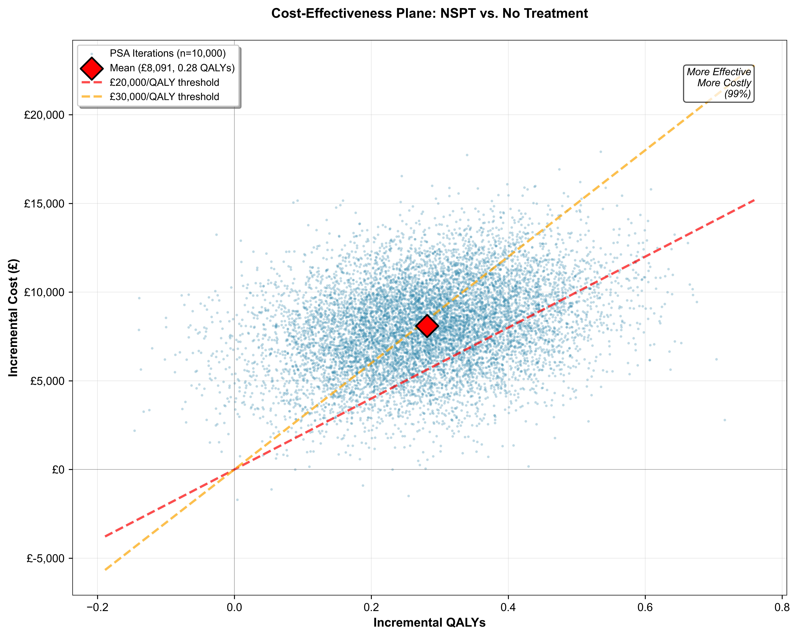

# Periodontal Health Impact Simulator



A research initiative to quantify the systemic health impacts of periodontal disease through health economic modeling.

## Project Overview

This repository contains two major health economic modeling projects examining the relationship between periodontal disease and systemic health conditions:

1. **Periodontal Disease and Alzheimer's Disease/Dementia (AD)** — Individual-based microsimulation
2. **Periodontal Disease and Cardiovascular Disease (CVD)** — Markov cohort model

---

## CVD Study — Submitted to Journal

**Model Type**: Markov cohort model
**Time Horizon**: 10 years
**Population**: 65-year-old adults with severe periodontal disease

**Key Features**:
- Eight health states including post-stroke, post-MI, and combinations
- Intervention: Non-surgical periodontal therapy
- Cost-effectiveness analysis against NICE thresholds (£20,000–£30,000/QALY)
- Tunnel states for acute vs. chronic event phases
- Probabilistic sensitivity analysis (10,000 Monte Carlo simulations)

**Status**: ✅ Submitted for peer review

**Location**: [`CVD_Study/`](CVD_Study/)

| File | Description |
|------|-------------|
| `Main_Text_CVD_Paper_finalised.tex` | Finalised manuscript |
| `Supplementary_Material_CVD.tex` | Technical appendix |
| `PD_CVD_markov - PSA On.xlsm` | Excel-based Markov model |
| `generate_cvd_figures.py` | Figure generation script |
| `images_CVD/` | Publication-ready figures |
| `EXCEL_MODEL_EXECUTION_GUIDE.md` | Model execution instructions |
| `CONTRIBUTING.md` | Contributor guidelines |
| `tests/` | CVD figure generation tests (26 tests) |

---

## AD Study — In Development

**Model Type**: Individual-level microsimulation
**Time Horizon**: 2023–2040
**Population**: England

**Key Features**:
- Four dementia stages: mild → moderate → severe → death
- Baseline periodontal prevalence scenarios: 25%, 50%, 75%
- Co-morbidity modelling: smoking, diabetes, cerebrovascular disease, cardiovascular disease
- Dual cost perspective: NHS and informal caregivers
- Outcomes: QALYs, costs, dementia cases prevented
- External validation against ONS and NHS prevalence data

### Model Versions

**v2** — [`AD_Study/v2/`](AD_Study/v2/)

| File | Description |
|------|-------------|
| `IBM_PD_AD_v2.py` | Core microsimulation model |
| `AD_FullText_v2.tex` / `AD_FullText_v2_65.md` | Manuscript drafts |
| `AD_Microsimulation_results/` | PSA results (25%, 50%, 75% scenarios) |
| `run_psa_direct_v2.py` | PSA runner |

**v3** — [`AD_Study/v3/`](AD_Study/v3/) *(current)*

| File | Description |
|------|-------------|
| `IBM_PD_AD_v3.py` | Updated microsimulation with PSA and sensitivity analysis |
| `AD_FullText_v3.tex` / `AD_FullText_v3.md` | Current manuscript |
| `Supplementary_Material_AD_65V3.docx` | Technical appendix |
| `external_validation.py` | External validation against published data |
| `pd_sensitivity_analysis.py` | One-way sensitivity analysis |
| `run_pd_tornado.py` | Tornado plot generation |
| `run_psa_direct_v3.py` | PSA runner |
| `psa_results_25_v3/` `psa_results_50_v3/` `psa_results_75_v3/` | PSA outputs |
| `plots/` | Generated figures |
| `tests/` | AD microsimulation tests (97 tests) + PSA workflow tests (14 tests) |

---

## Repository Structure

```
periodontal/
├── README.md
├── LICENSE
├── pytest.ini
├── requirements.txt
├── requirements-dev.txt
├── AD_Study/
│   ├── v2/                         # AD microsimulation v2
│   └── v3/                         # AD microsimulation v3 (current)
│       └── tests/                  # AD model + PSA tests (111 tests)
├── CVD_Study/                      # CVD Markov model and manuscript
│   └── tests/                      # CVD figure tests (26 tests)
└── docs/                           # Project planning documents
```

---

## Testing

```bash
# Install development dependencies
pip install -r requirements-dev.txt

# Run all tests
pytest

# Run with coverage
pytest --cov

# Run a specific suite
pytest AD_Study/v3/tests/test_ibm_pd_ad.py
```

**Test suite**: 137 tests — 132 passing, 5 skipped (pending PSA module)

---

## Methodology Summary

### Alzheimer's Disease Study

- **Design**: Hazard-based microsimulation
- **Cycle**: Annual time steps
- **Discount Rate**: 3.5% (costs and QALYs)
- **Data Sources**: NHS England Primary Care Dementia Data, ONS population projections
- **Key Parameters**:
  - PD hazard ratio for dementia onset: 1.47 (95% CI: 1.32–1.65)
  - PD hazard ratio for mortality: 1.36 (95% CI: 1.10–1.69)

### Cardiovascular Disease Study

- **Design**: State-transition Markov model
- **Cycle**: 1 year
- **Discount Rate**: 3.5% (costs and QALYs)
- **Data Sources**: UK Biobank, NHS cost collections, ONS life tables
- **Treatment Effects**:
  - Stroke hazard reduction: 0.40–0.78
  - MI hazard reduction: 0.54–0.90

---

## Compliance and Standards

- **Economic Evaluation**: Aligned with NICE guidelines for health technology assessment
- **Reporting**: CHEERS 2022
- **Cost Year**: 2024 GBP (HM Treasury GDP deflators)
- **Utility Values**: EQ-5D derived from UK population norms

## Data Sources

- NHS England Primary Care Dementia Data
- UK Biobank
- Office for National Statistics (ONS) population projections and life tables
- NHS National Cost Collection
- Adult Oral Health Survey 2021
- English Longitudinal Study of Ageing (ELSA)

---

## Citation

```
[Citation to be added upon publication]
```

## License

MIT License — see [LICENSE](LICENSE) for details.

Copyright (c) 2025 Kwaai, Personal AI Lab

## Contact

[Contact information to be added]

---

**Project Status**: Active Development
**Last Updated**: February 2026
